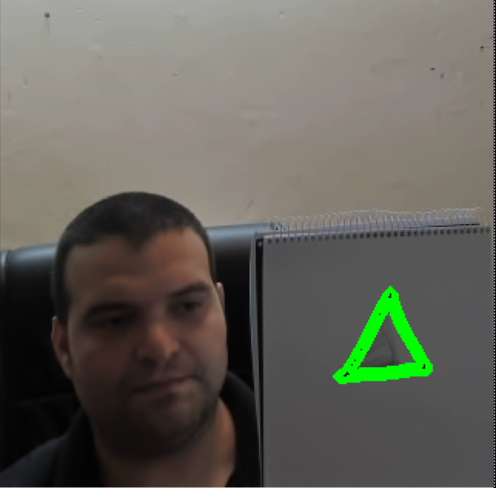
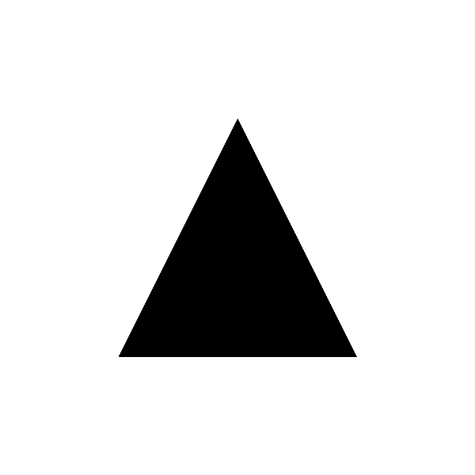

# Triangle Shape Detector from Live Camera

This project uses OpenCV to detect a specific shape (a triangle) shown on a white paper in front of a live webcam.

### 🧠 Main Features:
- Uses `cv2.matchShapes()` to detect contours similar to a triangle.
- Adaptive thresholding + contour filtering based on size.
- Filters small noisy shapes.
- Designed for real-world use, where lighting and background are imperfect.

### 🔧 Input:
- A printed triangle shown on white paper.
- Live camera feed.

### ✅ Output:
- Green contour drawn on matching shapes in live video.
- Detection threshold and size filtering configurable.

### 📷 Detection Example:

### 📐 Template Used:

